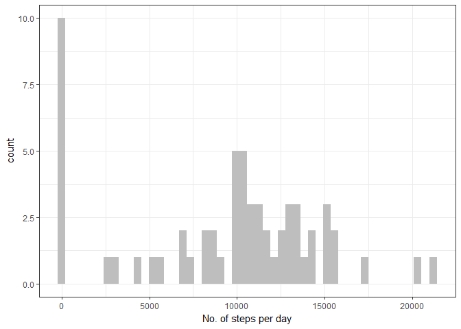
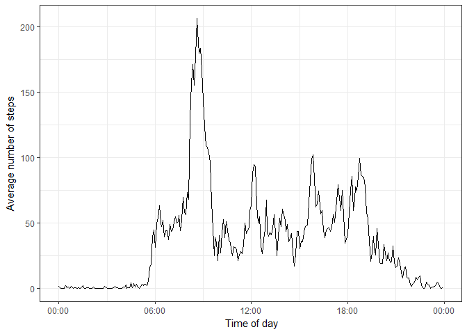
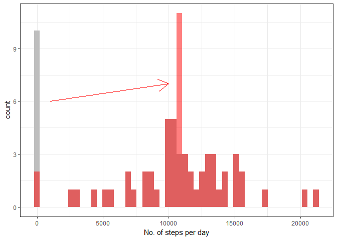
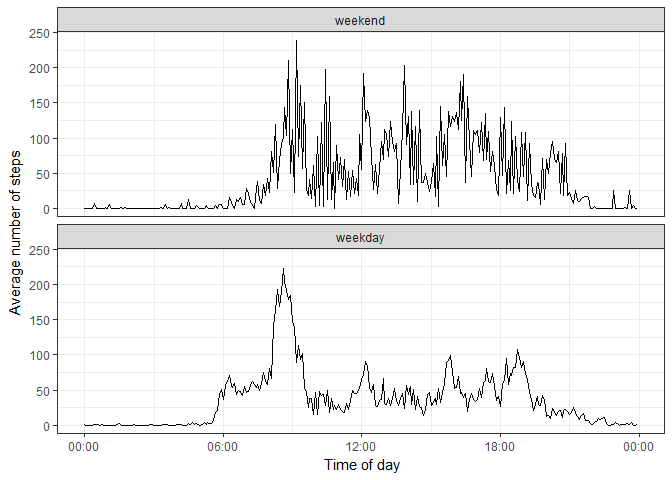

# Course project 1
April 14th 2017  
## Loading and preprocessing the data

I begin with downloading the file and putting contents into a dataframe   


```r
library(dplyr, quietly = TRUE,warn.conflicts = FALSE)
library(tidyr, quietly = TRUE,warn.conflicts = FALSE)
library(ggplot2,  quietly = TRUE)
download.file(url = "https://d396qusza40orc.cloudfront.net/repdata%2Fdata%2Factivity.zip",destfile = "activity.zip", quiet = TRUE)
unzip(zipfile = "activity.zip")
stepsdata <- read.csv(file = "activity.csv", header = TRUE, sep = "," )
stepsdata$date <- as.Date(stepsdata$date)
```

## What is mean total number of steps taken per day?

Data aggregation to convenient format and histogram plot:

```r
library(ggplot2)
dailysteps <- aggregate(x = stepsdata$steps, by = list(date = stepsdata$date), FUN = sum, na.rm = TRUE)
names(dailysteps)[2] <- "steps"
 
ggplot(dailysteps, aes(steps)) +
  geom_histogram(bins = 50,fill = "grey") +
  xlab("No. of steps per day") +
  theme_bw()
```

<!-- -->

The mean number of steps per day...

```r
mean(dailysteps$steps)
```

```
## [1] 9354.23
```

... and the median value

```r
median(dailysteps$steps)
```

```
## [1] 10395
```

## What is the average daily activity pattern?

The number of steps is averaged over time of day. Then I change format of the timestamp to the posixlt, in accordance with the assigment request. 

```r
stepspattern <- aggregate(x = stepsdata$steps, by = list(daytime = stepsdata$interval), FUN = mean, na.rm = TRUE )
stepspattern$daytime <- as.character(stepspattern$daytime)
for(i in 1:length(stepspattern$daytime)) {
for(j in 1:3) {
if(nchar(stepspattern$daytime[i]) == j) {
  stepspattern$daytime[i] <- paste("0", stepspattern$daytime[i], sep = "")
}}}
stepspattern$daytime <-  strptime(stepspattern$daytime, format = "%H%M")
```

Plotting the timeseries of the averaged daily steps

```r
ggplot(stepspattern, aes(daytime, x)) +
  geom_line() +
  labs(x =" Time of day", y = "Average number of steps") +
  scale_x_datetime(date_labels="%H:%M") +
  theme_bw()
```

<!-- -->

When is the time of the peak activity

```r
format(stepspattern$daytime[which(stepspattern$x==max(stepspattern$x))],format = "%H:%M")
```

```
## [1] "08:35"
```

## Imputing missing values

Note that there are a number of days/intervals where there are missing values (coded as NA). The presence of missing days may introduce bias into some calculations or summaries of the data.
The total number of rows with NAs:

```r
sum(is.na(stepsdata$steps))
```

```
## [1] 2304
```

Here I replace the missing data on steps with the value average value calculated for the whole period with NAs ignored and save the result in a new data frame:

```r
remNA <- aggregate(x = stepsdata$steps, by = list(interval = stepsdata$interval), FUN = mean, na.rm = TRUE )
remNA <- merge(stepsdata,remNA,by = "interval")
remNA <- arrange(remNA,date)
remNA$steps[is.na(remNA$steps)] <- remNA$x[is.na(remNA$steps)]
remNA$x <- NULL
```

Make a histogram of the total number of steps taken each day and Calculate and report the mean and median total number of steps taken per day. Do these values differ from the estimates from the first part of the assignment? What is the impact of imputing missing data on the estimates of the total daily number of steps?


```r
dailysteps2 <- aggregate(x = remNA$steps, by = list(date = stepsdata$date), FUN = sum, na.rm = TRUE)
names(dailysteps2)[2] <- "steps_remNA"
old_and_new_hist <- left_join(dailysteps,dailysteps2)
```

```
## Joining, by = "date"
```

```r
ggplot(old_and_new_hist) +
  geom_histogram(aes(steps), bins = 50, alpha = 1, fill="grey") +
  geom_histogram(aes(steps_remNA), bins = 50, alpha=0.5, fill="red") +
  xlab("No. of steps per day") +
    geom_segment(aes(x = 1000, y = 6, xend = 10000, yend = 7), colour = "red", arrow = arrow()) +
  theme_bw()
```

<!-- -->

The histograms are identical apart from number of instances moved from 0 to ~10766, the average value calculated with NAs ignored. 

Impact of NAs replacement on mean and medain values: 

```r
summary(old_and_new_hist)[,2:3]
```

```
##      steps        steps_remNA   
##  Min.   :    0   Min.   :   41  
##  1st Qu.: 6778   1st Qu.: 9819  
##  Median :10395   Median :10766  
##  Mean   : 9354   Mean   :10766  
##  3rd Qu.:12811   3rd Qu.:12811  
##  Max.   :21194   Max.   :21194
```

Both median and mean have increased.

##Are there differences in activity patterns between weekdays and weekends?

Here I make the calculations. In the factors there are my native names for the weekdays, but it would be another pain to correct them or mess with locale. 


```r
pattern<-stepsdata
for(i in 1:length(pattern$interval)) {
  for(j in 1:3) {
    if(nchar(pattern$interval[i]) == j) {
      pattern$interval[i] <- paste("0",pattern$interval[i],sep="")
    }}}
pattern$datetime <- strptime(x = paste(pattern$date,pattern$interval),format = "%Y-%m-%d %H%M")
pattern$weekday[weekdays(pattern$datetime,abbreviate = FALSE) == c("sobota","niedziela")] <- "weekend"
pattern$weekday[weekdays(pattern$datetime,abbreviate = FALSE) != c("sobota","niedziela")] <- "weekday"
pattern$weekday <- factor(pattern$weekday, levels = c("weekend", "weekday"))

pattern <- aggregate(x = pattern$steps, by = list(daytime = substr(pattern$datetime,12,16), day = pattern$weekday), FUN = mean, na.rm = TRUE )
pattern$daytime <- as.POSIXlt(pattern$daytime,format="%H:%M")
```

...and here goes the plot:

```r
ggplot(pattern, aes(daytime, x)) +
  geom_line() +
  labs(x =" Time of day", y = "Average number of steps") +
  scale_x_datetime(date_labels = "%H:%M") +
  theme_bw()+
  facet_wrap(~day, ncol=1)
```

<!-- -->

Obviously the subject sleeps longer and walks more on weekends :)
